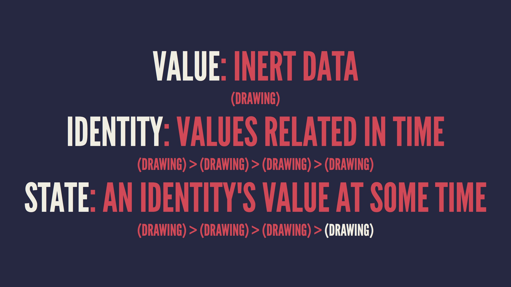

# Swift-hints
It's just a little collection of hints and lessons that I've learned from some talks, articles and so on.

## Embrace Immutability
(https://realm.io/news/slug-keith-smiley-embrace-immutability/)

#### Dumb models
In server-driven applications, client models **must** be as immutable as possible.
```swift
struct Ride: Mappable {
    var pickup: Place?
}
```
This code is completely unsafe. Instead, we can create mutable substitutes and receive immutable "dumb models" from the server:
```swift
struct RideRequest {
    var pickup: Place?
}
```
###### Application
In [SwiftyNURE](https://github.com/dreymonde/SwiftyNURE) models which have no sense to be changed (it just won't affect anything), were looking like this:
```swift
public struct Subject {
    public var id: Int
    public var name: String
    public var shortName: String
}
```
Much cleaner now:
```swift
public struct Subject {
    public let id: Int
    public let name: String
    public let shortName: String
}
```
#### Parsing heterogeneous data
The problem with most JSON mappers is that they encourage to create mutable models, or models with optional properties (which is not quite good in many cases). For example, [Gloss](https://github.com/hkellaway/Gloss):
```swift
init?(json: JSON) {
        guard let ownerId: Int = "id" <~~ json
            else { return nil }

        self.ownerId = ownerId
        self.username = "login" <~~ json
    }
```
This `guard let` statement looks like you're doing something wrong when you're using it, instead of "much simpler" possibilities written below. The secret is that all other properties are *optionals*, which is awful when you're dealing with ID's, names, passwords and other pretty important stuff. Instead, "throwable" initializers in Lyft's [Mapper](https://github.com/lyft/mapper) looks much cleaner and they're actually ***embracing immutability***:
```swift
init(map: Mapper) throws {
    try id = map.from("id")
    photoURL = map.optionalFrom("avatar_url")
  }
```
You can still use `optionalFrom` when you really need that optional, in other cases it's just safer and simplier to have non-optional immutable properties.

## Swift Scripting
(https://realm.io/news/swift-scripting/ 
http://www.bensnider.com/using-swift-to-make-command-line-scripts-part-2.html
http://cerebration.typed.com/blog/swift-2-as-a-scripting-language)

#### Using third-party frameworks
There are two common ways to use third-party frameworks. First is to place them in /Library/Frameworks/ and then place following shebang in the beginning of .swift file:
```
#!/usr/bin/env xcrun swift -F /Library/Frameworks
```
It's kinda ugly because you need to manually build all frameworks and place them in just one place. Much better is to use Carthage just as with any other Swift project:
```
#!/usr/bin/env xcrun swift -F Carthage/Build/Mac
```

#### Executing scripts
The easier way is to make .swift file executable with `chmod +x` command, but this not giving you the actual *executable*, it's just running the script line-by-line. Instead, you can use `swiftc` or `xcrun`:
```
$ swiftc hello.swift
// or
$ xcrun -sdk macos swiftc hello.swift
```
If you wan't to use third-party frameworks (via Carthage), it becomes a less uglier:
```
$ xcrun -sdk macosx swiftc -F Carthage/Build/Mac/ btc.swift -Xlinker -v -Xlinker -rpath -Xlinker @executable_path/Carthage/Build/Mac/
```
And you can't actually pack the executable with the frameworks, you're just *linking* to them. Sadly, but that's how dynamic frameworks actually work.

## Functional View Controllers
(https://www.youtube.com/watch?v=uQFI9rDrl8s)

#### Lighter view controllers
It's a good practice to put some work *out* of view controllers which are insanely complex. A lot of "model stuff" needs to be implemented by model - for example, `UITableViewDataSource`. Same thing with the views.

## Swift-ly Secure
(https://realm.io/news/seth-law-swift-security/)

- Your product does *not* trust it's users.
- Most of Apple's storaging APIs does not provide an encryption.
- Starting from iOS 8.3, you can't access file system, but still can access it with the backups.
- Don't store sensitive data in the property lists.
- Store it in the Keychain.
- Be aware of App Sharing.
- There is no good reason not to encrypt anymore.
- Third-party frameworks can't be 100% trusted.
- Security is hard. *Try harder.*

## Functional Reactive Awesome
(https://realm.io/news/altconf-ash-furrow-functional-reactive-swift/)

- Three main concepts: streams, transformations and bindings.
- Streams are "pipes": if you don't catch what's going outside of it, it's gone forever.
- Make a stream, transform that stuff to another stuff, and then bind *that* stuff to things. `¯\_(ツ)_/¯`
 
> If you wanted to explicitly cancel it, that is very imperative of you. Not that there’s anything wrong with imperative programming, but when you’re using Functional Reactive Programming, it’s like having Google’s Chromecast in an Apple ecosystem. Your life is a little bit harder. When you’re doing Functional Reactive Programming, the more imperative code you use, the harder your life is. If you buy into this ecosystem of FRP, just like when you buy into the ecosystem of Apple, things get easier.

## Mixins and Traits in Swift 2.0
(http://matthijshollemans.com/2015/07/22/mixins-and-traits-in-swift-2/)

- Prefer composition over inheritance. Because *inheritance kinda sucks*.

#### Massive View Controllers is a bad thing (again)
"Default" way to validate username and password:
```swift
class LoginViewController: UIViewController {
  private func isUsernameValid(username: String) -> Bool {
    ...
  }

  private func isPasswordValid(password: String) -> Bool {
    ...
  }

  @IBAction func loginButtonPressed() {
    if isUsernameValid(usernameTextField.text!) && 
       isPasswordValid(passwordTextField.text!) {
      // proceed with login
    } else {
      // show alert
    }
  }
  ...
}
```

Well, that is a *bad* practice and rapidly leading you to *Massive View Controllers*.
The first thing that pops in mind is to create another classes which validate username and password:
```swift
class UsernameValidator {
  func isUsernameValid(username: String) -> Bool {
    ...
  }
}

class LoginViewController: UIViewController {
  let usernameValidator = UsernameValidator()
  let passwordValidator = PasswordValidator()
  ...
}
```

That's better and lighter, but we can make even better and cooler solution using ***protocols***.
```swift
protocol ValidatesUsername {
  func isUsernameValid(password: String) -> Bool
}

extension ValidatesUsername {
  func isUsernameValid(username: String) -> Bool {
    ...
  }
}
```

Now, we can add conformance to this protocol for our View Controller, and voilà:
```swift
class LoginViewController: UIViewController, ValidatesUsername, ValidatesPassword {
  @IBAction func loginButtonPressed() {
    if isUsernameValid(usernameTextField.text!) && 
       isPasswordValid(passwordTextField.text!) {
      // proceed with login
    } else {
      // show alert
    }
  }
}
```

> With inheritance the only structure you can make is a hierarchy. But by placing your reusable code in protocol extensions, you’re no longer limited to just hierarchies — you’ve got more freedom in how you stick your building blocks together to build bigger components.

## Making Friends with Value Types
(https://realm.io/news/andy-matuschak-controlling-complexity/)

- Almost everything in the Swift standard library is a value type.
- *Swift <3 values.*
- Value types are inert, isolated and interchangeable.
- It just doesn't matter whether we call a mutable method on a struct variable, or assign it to a new value. The only thing that matters is the *value*, and it doesn't give a shit about anything else.
- You can't *mutate* the value, you just change the *variable* that storing the value.

#### Values, objects and states

**Quick thought**: values are values - it's a natural state around us, a three-dimensional entity. Object has a fourth dimension - it has time.

#### Object layer and value layer
Think of your app as being in two layers: the object layer and the value layer. Object value should react and behave, but all of the logic should be accomplished in the value layer. 
> The object layer is full of objects that are just a thin veneer that consume events, consult the value layer to compute a new value, then store it. All of the business logic of your application lives in the value layer. If we think about it in this way, we can really get to a picture where the object layer is tiny and the value layer contains the bulk of the application.
